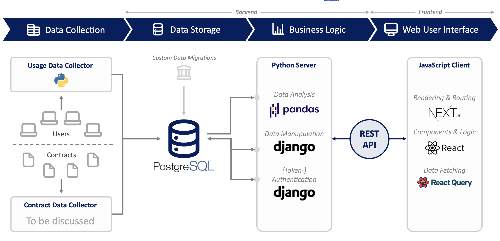
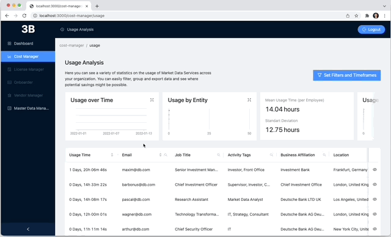
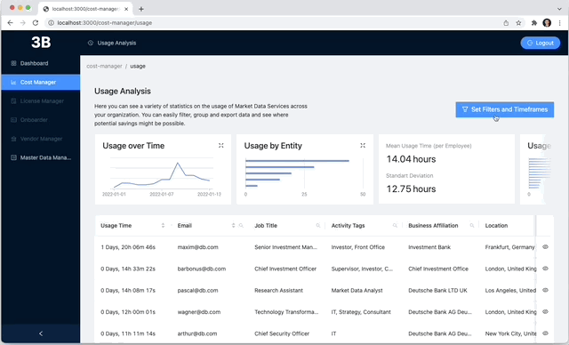
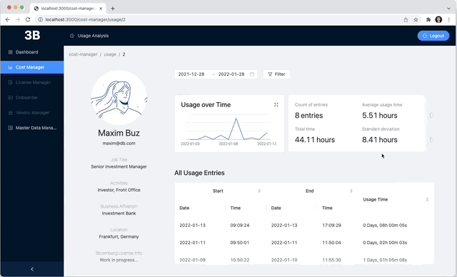
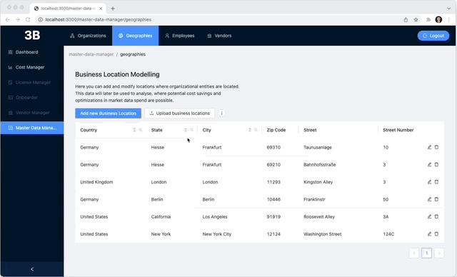
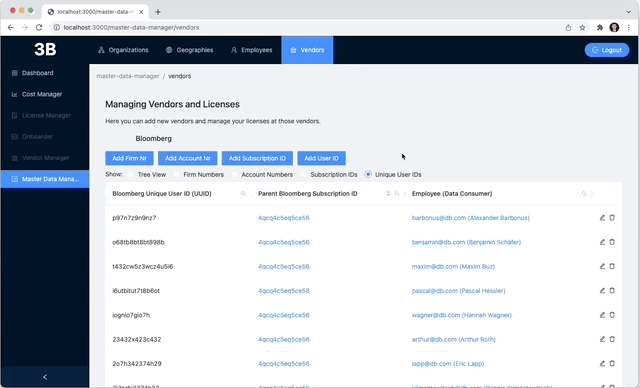

<div id="top"></div>

<!-- PROJECT SHIELDS -->
[![LinkedIn][linkedin-shield]][linkedin-url]


<!-- PROJECT LOGO -->
<br />
<div align="center">
  

  <h3 align="center">MARKET-DATA-VENDOR MANAGER</h3>

  <p align="center">
    A Django and React Prototype Application
    <br/>
    Developed by <a href="https://www.linkedin.com/in/maxim-buz-17a2a717b/">Maxim Buz</a>
    <br/>
    <a href="https://vendor-manager.vercel.app/">View Demo</a>
    <br/>
    Username: public
    <br/>
    Password: JafRGAWGDq5up4G
  </p>
</div>


<!-- TABLE OF CONTENTS -->
<details>
  <summary>Table of Contents</summary>
  <ol>
    <li>
      <a href="#about-the-project">About The Project</a>
      <ul>
        <li><a href="#built-with">Built With</a></li>
      </ul>
    </li>
    <li><a href="#usage">Usage</a></li>
    <li><a href="#roadmap">Roadmap</a></li>
    <li><a href="#contact">Contact</a></li>
  </ol>
</details>


<!-- ABOUT THE PROJECT -->
## About The Project

[![Product Name Screen Shot][product-screenshot]](https://vendor-manager.vercel.app/)

This app was created as a prototype for a corporate web-application constisting of three seperate projects: The front-end, the back-end and the usage-tracker.

Here are the currently implemented main use-cases:
* Collect, store and manage data on your company structure, your employees, your market data vendors (currently only Bloomberg) and geographies inside the **Master Data Manager** Module
* Collect and centralize data on how long your employees use specific market data software with the **Usage Tracker**
* Visualize, Filter and Analyse software usage data (currently only Bloomberg Anywhere) across your whole organization with the **Cost Manager / Usage Analysis** module

<p align="right">(<a href="#top">back to top</a>)</p>


### Technologies

Tool Selection Philosophy:
* Finding a BALANCE between battle-tested and secure solutons (backend) and highly modern and efficient technologies (frontend)
* Implementng technologies that permit FAST-PACED development and a great developer experience
* Focus on highly available open-source technologies with a LARGE USER-BASE AND TALENT-POOL for easier recruiting down the road

Following technologies were chosen:

Front-End:
* [Next.js](https://nextjs.org/)
* [React.js](https://reactjs.org/)
* [React Query](https://react-query.tanstack.com/)
* [Ant Design](https://github.com/ant-design/ant-design)

Back-End:
* [Django](https://www.djangoproject.com/)
* [Django REST Framework](https://www.django-rest-framework.org/)
* [Django REST Auth](https://github.com/iMerica/dj-rest-auth)
* [PostgreSQL](https://www.postgresql.org/)

Usage-Tracker:
* [Python](https://www.python.org/) (substantial parts by KalleHallden)



<p align="right">(<a href="#top">back to top</a>)</p>


### Installation

## Frontend
1. ```bash
   cd frontend/ && npm install
   ```
2. ```bash
   npm run dev
   ```
## Backend
1. Go to project root and run
   ```bash
   python3 -m venv env
   source env/bin/activate
   ```
2. ```bash
   python3 -m pip install -r requirements.txt
   ```
3. Inside <code>./backend_api/</code> create a .env file and add the following variables. Please use a PostgreSQL database and an SMTP email server.
   ```bash
   SECRET_KEY=
   DEBUG=True
   DB_NAME=
   DB_USER=
   DB_PASSWORD=
   DB_HOST=
   DB_PORT=
   EMAIL_HOST=
   EMAIL_HOST_USER=
   EMAIL_HOST_PASSWORD=
   EMAIL_PORT=
   DEFAULT_FROM_EMAIL=
   ```
4. Setup the database tables
   ```bash
   python manage.py migrate
   ```
5. Setup a user
   ```bash
   python manage.py createsuperuser
   ```
6. To start the server run
   ```bash
   python manage.py runserver
   ```
   
Now open the frontend on localhost:3000 and login with your superuser account.
<p align="right">(<a href="#top">back to top</a>)</p>


<!-- USAGE EXAMPLES -->
## Usage examples

See the prototype in action with some of these usage examples!

1. Visualizing usage over time


2. Advanced data filtering


3. Employee Detail View


4. Adding new buildings to a business location


5. Send an usage tracker installation request to license-holder


<p align="right">(<a href="#top">back to top</a>)</p>


<!-- CONTACT -->
## Contact

Maxim Buz - [LinkedIn](https://www.linkedin.com/in/maxim-buz-17a2a717b/) - mbuz.maxim@gmail.com

Project Link: [https://github.com/MaximBuz/data-vendor-manager/](https://github.com/MaximBuz/vendor-manager/)

<p align="right">(<a href="#top">back to top</a>)</p>


<!-- MARKDOWN LINKS & IMAGES -->
<!-- https://www.markdownguide.org/basic-syntax/#reference-style-links -->
[linkedin-shield]: https://img.shields.io/badge/-LinkedIn-black.svg?style=for-the-badge&logo=linkedin&colorB=555
[linkedin-url]: https://www.linkedin.com/in/maxim-buz-17a2a717b/
[product-screenshot]: images/screenshot.png
